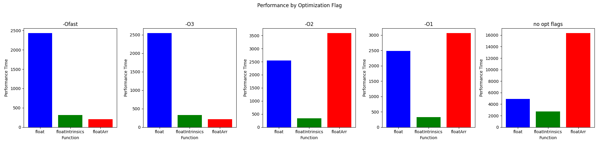
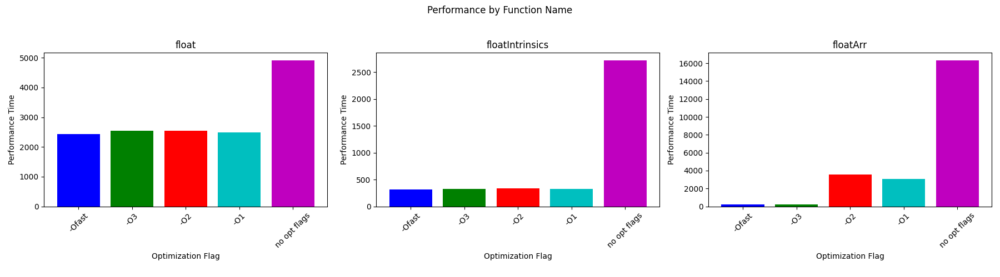

# MandelbrotSetCalcOptimization

Implementation of Mandlebrot set. You can move around and zoom into picture.

You can either run simulation or perform tests on calculation functions. For both cases you have to run commands from repository root directory.

To run simulation
```
make compileAndRun
```

To run tests on calculation funcs:
```
make compileTestPerf
building/testPerf float
```
Takes exactly one argument, name of calculation function (can be "float", "floatIntrinsics", "highRes", "floatArr")

To clean building directory:
```
make clean
```

highRes - very slow, but allows user to zoom deeper in, because long double can store really enormous values with high precision.

float - standart function, uses float data type, so it's now as good as highRes in zooming, but it works much faster, because float is only 4 bytes, when long double is 16

floatIntrinsic - optimization of float function. On each row of pixels, perfoms calculation for 8 consequent pixels simultaneously by using intrinsics.

floatArr - another optimization, uses same idea as floatIntrinsic function, but instead of __m256 registers simple arrays are used and functions to effictively work with them (add, sub, mul, compare). This approach achieves higher perfomance, because we can adjust block size (how many operations of cycle we unroll) and we are not limited by 256 bits. Also some intrinsic functions simply don't exist or are too general, so as we know exactly what we need to do, we can write our own methods which will be faster.

Perfomance data:

| Optimization Flag     | float       | floatIntrinsics | floatArr    |
|-----------------------|-------------|-----------------|-------------|
| -Ofast                | 2431.33     | 314.37          | 206.54      |
| -O3                   | 2546.72     | 329.52          | 213.13      |
| -O2                   | 2544.55     | 333.00          | 3592.11     |
| -O1                   | 2480.52     | 328.85          | 3064.07     |
| no optimization flags | 4918.51     | 2724.70         | 16347.49    |





Ofast optimization flag shows best perfomance, as the bottleneck of whole calculation function is cycle for point till it leaves some fixed radius, where we use a lot of floating point operations. Because Ofast allows compiler to ignore some restrictions caused by IEEE754 format (no associativity a + (b + c) != (a + b) + c, checks if operand are normalized values, i.e. they are finite (not +- inf) and not nan (not a number)). However it causes some problems, because programm becomes unstable and calculation overflows happen.

O3 flag seems to be the best, as it's almost as good as Ofast optimization flag and programm continues to work correctly.
