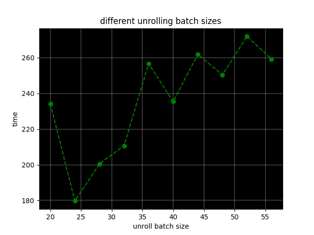

# MandelbrotSetCalcOptimization

Implementation of Mandlebrot set. You can move around and zoom into picture.

You can either run simulation or perform tests on calculation functions. For both cases you have to run commands from repository root directory.

To run simulation:
```
make compileAndRun
```

To run tests on calculation funcs:
```
make compileTestPerf
building/testPerf float
```
Takes exactly one argument, name of calculation function (can be "float", "floatIntrinsics", "highRes", "floatArr")

To clean building directory:
```
make clean
```

Different calculation functions:

* highRes - very slow, but allows user to zoom deeper in, because long double can store enormous values with high precision.

* float - standart function, uses float data type, so it's not as good as highRes in zooming, but it works much faster, because float is only 4 bytes, when long double is 16.

* floatIntrinsic - optimization of float function. On each row of pixels, perfoms calculation for 8 consequent pixels simultaneously by using intrinsics.

* floatArr - another optimization, uses same idea as floatIntrinsic function, but instead of __m256 registers simple arrays are used and functions to effictively work with them (add, sub, mul, compare). This approach achieves higher perfomance, because we can adjust block size (how many operations of cycle we unroll) and we are not limited by 256 bits. Also some intrinsic functions simply don't exist or are too general, so as we know exactly what we need to do, we can write our own methods which will be faster.

Perfomance data (time measured in ms):

| Optimization flags   | float          | floatIntrinsics   | floatArr         |
|:---------------------|:---------------|:------------------|:-----------------|
| -Ofast               | 2431 &#177; 19 | 314 &#177; 8      | 180 &#177; 7     |
| -O3                  | 2546 &#177; 8  | 329 &#177; 6      | 187 &#177; 4     |
| -O2                  | 2544 &#177; 49 | 333 &#177; 5      | 3149 &#177; 53   |
| -O1                  | 2480 &#177; 64 | 328 &#177; 2      | 3515 &#177; 28   |
| no opt flags         | 4918 &#177; 36 | 2724 &#177; 4     | 16328 &#177; 210 |

Relative speed up, comparison inside each column with "no optimization flags" row:

| Optimization flags   | float   | floatIntrinsics   | floatArr   |
|:---------------------|:--------|:------------------|:-----------|
| -Ofast               | 2.02    | 8.68              | 90.71      |
| -O3                  | 1.93    | 8.28              | 87.32      |
| -O2                  | 1.93    | 8.18              | 5.19       |
| -O1                  | 1.98    | 8.3               | 4.65       |

Relative speed up, comparison inside each row with "basic" calc function ("float" column):

| Optimization flags   | floatIntrinsics   | floatArr   |
|:---------------------|:------------------|:-----------|
| -Ofast               | 7.74              | 13.51      |
| -O3                  | 7.74              | 13.61      |
| -O2                  | 7.64              | 0.81       |
| -O1                  | 7.56              | 0.71       |
| no opt flags         | 1.81              | 0.3        |


**Ofast** optimization flag shows best perfomance, as the bottleneck of whole calculation function is cycle for point till it leaves some fixed radius, where we use a lot of floating point operations. Because **Ofast** allows compiler to ignore some restrictions caused by IEEE754 format (no associativity a + (b + c) != (a + b) + c, checks if operand are normalized values, i.e. they are finite (not +- inf) and not nan (not a number)). However it causes some problems, because programm becomes unstable and calculation overflows happen.

**O3** flag seems to be the best, as it's almost as good as **Ofast** optimization flag and programm continues to work correctly.

How fast implementation on array works depending on unroll batch size:



unroll batch size step is 4, begins with 20 and ends with 56.

At batch size 16, programm still works very long (1500 ms), but then suddenly, at batch size 20, it begins to work way faster (234 ms). Optimal batch size, as my expirements showed, is 24 (in this case programm works only 179 ms)

System info:

* lscpu output:

```
Architecture:             x86_64
  CPU op-mode(s):         32-bit, 64-bit
  Address sizes:          46 bits physical, 48 bits virtual
  Byte Order:             Little Endian
CPU(s):                   20
  On-line CPU(s) list:    0-19
Vendor ID:                GenuineIntel
  Model name:             13th Gen Intel(R) Core(TM) i9-13900H
    CPU family:           6
    Model:                186
    Thread(s) per core:   2
    Core(s) per socket:   14
    Socket(s):            1
    Stepping:             2
    CPU max MHz:          5400,0000
    CPU min MHz:          400,0000
    BogoMIPS:             5990.40
    Flags:                fpu vme de pse tsc msr pae mce cx8 apic sep mtrr pge m
                          ca cmov pat pse36 clflush dts acpi mmx fxsr sse sse2 s
                          s ht tm pbe syscall nx pdpe1gb rdtscp lm constant_tsc
                          art arch_perfmon pebs bts rep_good nopl xtopology nons
                          top_tsc cpuid aperfmperf tsc_known_freq pni pclmulqdq
                          dtes64 monitor ds_cpl vmx smx est tm2 ssse3 sdbg fma c
                          x16 xtpr pdcm pcid sse4_1 sse4_2 x2apic movbe popcnt t
                          sc_deadline_timer aes xsave avx f16c rdrand lahf_lm ab
                          m 3dnowprefetch cpuid_fault epb ssbd ibrs ibpb stibp i
                          brs_enhanced tpr_shadow flexpriority ept vpid ept_ad f
                          sgsbase tsc_adjust bmi1 avx2 smep bmi2 erms invpcid rd
                          seed adx smap clflushopt clwb intel_pt sha_ni xsaveopt
                           xsavec xgetbv1 xsaves split_lock_detect user_shstk av
                          x_vnni dtherm ida arat pln pts hwp hwp_notify hwp_act_
                          window hwp_epp hwp_pkg_req hfi vnmi umip pku ospke wai
                          tpkg gfni vaes vpclmulqdq tme rdpid movdiri movdir64b
                          fsrm md_clear serialize pconfig arch_lbr ibt flush_l1d
                           arch_capabilities
Virtualization features:
  Virtualization:         VT-x
Caches (sum of all):
  L1d:                    544 KiB (14 instances)
  L1i:                    704 KiB (14 instances)
  L2:                     11,5 MiB (8 instances)
  L3:                     24 MiB (1 instance)
NUMA:
  NUMA node(s):           1
  NUMA node0 CPU(s):      0-19
Vulnerabilities:
  Gather data sampling:   Not affected
  Itlb multihit:          Not affected
  L1tf:                   Not affected
  Mds:                    Not affected
  Meltdown:               Not affected
  Mmio stale data:        Not affected
  Reg file data sampling: Mitigation; Clear Register File
  Retbleed:               Not affected
  Spec rstack overflow:   Not affected
  Spec store bypass:      Mitigation; Speculative Store Bypass disabled via prct
                          l
  Spectre v1:             Mitigation; usercopy/swapgs barriers and __user pointe
                          r sanitization
  Spectre v2:             Mitigation; Enhanced / Automatic IBRS; IBPB conditiona
                          l; RSB filling; PBRSB-eIBRS SW sequence; BHI BHI_DIS_S
  Srbds:                  Not affected
  Tsx async abort:        Not affected
```

* g++ version:

```
g++ (Ubuntu 11.4.0-1ubuntu1~22.04) 11.4.0
```
